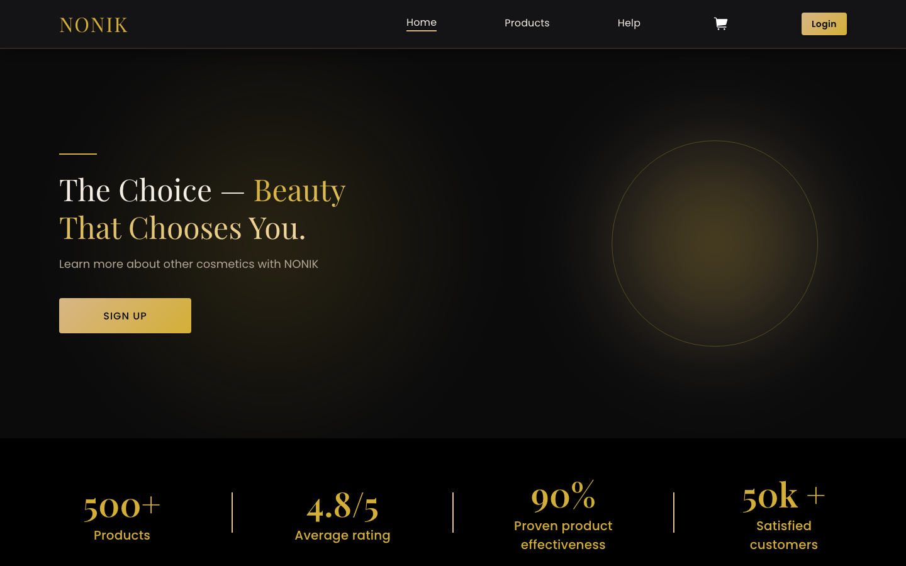
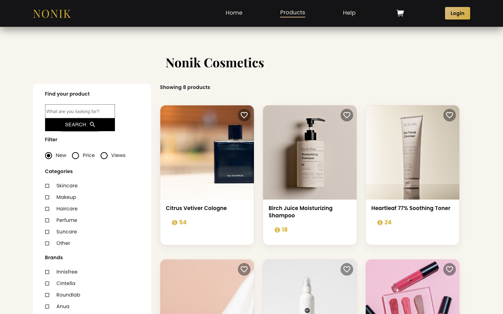
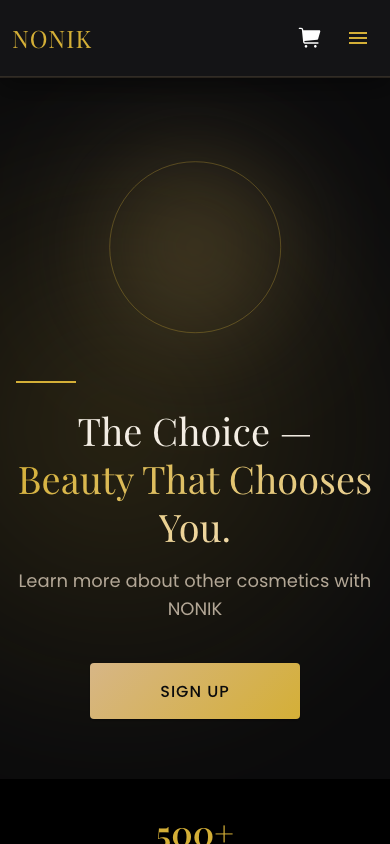

# Nonik — Korean Cosmetics E-Commerce Storefront

Nonik is a full-featured e-commerce storefront for a Korean cosmetics brand, built with React, TypeScript, and Redux Toolkit.

## About

Nonik lets customers browse and search a catalog of Korean skincare and cosmetics products, take an interactive skin-type quiz to get product recommendations, add items to a basket and check out, track their orders through paused/processing/finished stages, save favorite products, and manage their profile. Products, orders, and members are managed through a companion Express/MongoDB backend — this repository contains only the client application.

## Tech Stack

- **React 18** + **TypeScript**
- **Redux Toolkit** + **react-redux** for state management
- **MUI v6** (`@mui/material`, `@mui/icons-material`, `@mui/lab`) with `@emotion` for styling, alongside `styled-components`
- **react-router-dom v5** for routing
- **axios** for HTTP requests
- **socket.io-client** for realtime features
- **Swiper** for carousels/sliders
- **sweetalert2** for alerts/dialogs
- **moment** for date handling
- Bootstrapped with **Create React App** (`react-scripts`)

## Key Features

- Product catalog with browsing, search, and filtering
- Interactive skin-type quiz with tailored product suggestions
- Basket and checkout flow
- Order tracking across Paused / Process / Finished tabs
- Favorites (liked products) list
- User profile and account settings
- Realtime updates via Socket.IO
- Responsive, mobile-first layout with a dark-luxury visual theme
- Home page sections: brand story, flash-sale banner, category navigation, top/new products, statistics, and testimonials

## Architecture

The app lives under `src/app/` and is organized as:

- `screens/` — top-level pages (`homePage`, `productsPage`, `ordersPage`, `userPage`, `helpPage`), several with their own Redux `slice.ts`/`selector.ts`
- `components/` — shared UI building blocks (headers, footer, basket, product grid, order list, auth, etc.)
- `services/` — API clients (`ProductService`, `OrderService`, `MemberService`, `FavoriteService`, `ContactService`) that talk to the backend
- `hooks/` — reusable custom hooks
- `store.ts` — Redux store configuration
- `context/`, `api/`, `types/`, `enums/`, `data/` — supporting utilities, TypeScript types, and static data

The frontend communicates with a separate **Express + TypeScript + MongoDB** backend. See [`RELATED_REPO.md`](./RELATED_REPO.md) for local setup notes, and the backend repository itself: [github.com/Sherzod-1998/nonik](https://github.com/Sherzod-1998/nonik).

## Getting Started

### Prerequisites

- Node.js (developed/tested with v20)
- Yarn

### Installation

```bash
yarn install
```

### Environment Variables

Create a `.env` file in the project root with:

```
REACT_APP_API_URL=http://localhost:3003
```

This should point to the URL where the backend API is running.

### Run (development)

```bash
yarn start
```

### Build (production)

```bash
yarn build
```

## Live Demo

[nonik.uz](https://nonik.uz)

## Screenshots

| Homepage | Products |
|---|---|
|  |  |

| Mobile |
|---|
|  |

## License / Author

MIT — see [LICENSE](./LICENSE). Author: [Sherzod-1998](https://github.com/Sherzod-1998)
